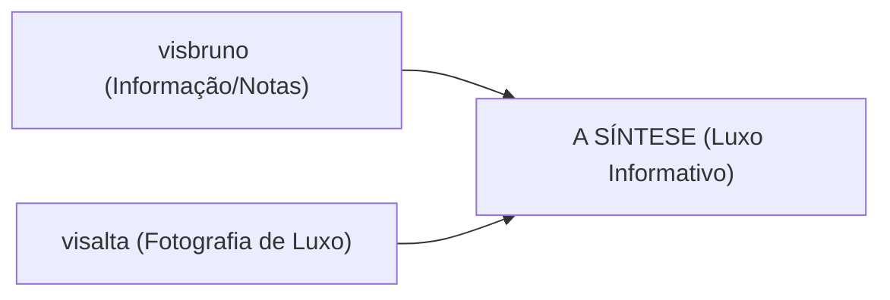

# Diretrizes de Identidade Visual - Projeto Bruno

Este documento reúne as premissas estéticas, sensoriais e jurídicas que devem guiar a criação de todas as artes, campanhas, layouts e fotos para a marca de decantes do Bruno. Ele serve como referência obrigatória sempre que iniciarmos qualquer trabalho na pasta `Identidadevisual`.

---

## ⚖️ 1. Premissas Jurídicas (Uso de Imagens e Marcas)

> [!NOTE]
> **Liberdade de Marca e Propriedade Intelectual:**
> Para este projeto específico, a parte de restrições jurídicas de marca não é uma barreira comercial ou criativa. 

*   **Uso de Frascos Originais:** Está expressamente autorizado o uso de fotografias reais dos frascos originais dos perfumes (ex: Amouage, Xerjoff, Creed, etc.) em toda a comunicação visual.
*   **Destaque dos Nomes de Marca:** Os nomes das marcas originais e dos perfumes devem ser exibidos em destaque nas peças, sem a necessidade de omiti-los ou atenuá-los.
*   **Foco na Fidelidade:** A identidade deve transmitir a autenticidade de que o decante provém diretamente do frasco original exibido.

---

## 🎨 2. Premissas Estéticas (A Síntese Estética)

A nossa linha de design é a **fusão direta** de dois mundos coletados nas referências locais (`fotos/visbruno` e `fotos/visalta`).

### O Conceito da Síntese
*   **Fotografia de Alta Fidelidade (Base de `visalta`):** Fotos reais do trio de decantes (2ml, 5ml e 10ml) com sprays metálicos (dourado ou preto fosco) e rótulos de papel linho texturizado sob a marca **"Montalk - Parfum d'Artiste"**.
*   **Ambientação Nobre:** Os decantes repousam sobre superfícies de mármore branco polido ou pedras rústicas, acompanhados dos ingredientes físicos reais em primeiro plano (ex: mel escorrendo, folhas de tabaco secas, flores de jasmim frescas) e o frasco original desfocado ao fundo (efeito bokeh).
*   **Integração Gráfica Fina (Evolução de `visbruno`):** Em vez de usar imagens recortadas flutuando, a pirâmide olfativa (notas de topo, coração e fundo) será inserida na imagem através de uma **tipografia minimalista, limpa e elegante** diretamente sobreposta de forma suave e transparente nas laterais da fotografia principal.

---

## 🏛️ 3. Experiência de Loja de Nicho (Imersão Histórica)

Queremos que o cliente sinta que está entrando em uma boutique clássica de perfumes de nicho na Europa ao navegar pelo nosso portfólio.

*   **Fotografias de Domínio Público:** Utilização de imagens icônicas de domínio público que retratam interiores de perfumarias históricas de Paris, Florença ou Londres (com armários de madeira maciça, balcões de mármore esculpido, iluminação quente e frascos antigos de farmácia/perfumaria).
*   **Contextualização Espacial:** Essas fotos icônicas servirão como planos de fundo para banners da loja, transições de páginas e peças de marketing, criando a verossimilhança de um estabelecimento físico de altíssimo luxo.

---

## 📦 4. Catálogo de Perfumes Disponíveis

O catálogo consolidado com todas as 79 fragrâncias e marcas exclusivas foi criado e está documentado em:
[catalogo_perfumes.md](file:///C:/Users/odeao/OneDrive/Desktop/brem/PROJETOS/Bruno/Decante/catalogo_perfumes.md)

Este catálogo serve de base para precificação em lote e referências visuais de cada perfume.

---

## 💬 5. Diretrizes de Comunicação e Performance (Longevidade)

Para garantir transparência com o cliente e alinhar suas expectativas de uso, toda vez que descrevermos a performance dos perfumes, devemos traduzir as classificações qualitativas de longevidade do Fragrantica em faixas de horas estimadas:

*   **Muito Fraco (Poor):** 1 a 3 horas de fixação estimada na pele.
*   **Fraco (Weak):** 3 a 4 horas de fixação estimada na pele.
*   **Moderada (Moderate):** 4 a 6 horas de fixação estimada na pele.
*   **Longa Duração (Long Lasting):** 6 a 10 horas de fixação estimada na pele.
*   **Eterno (Eternal):** Mais de 10 a 12 horas de fixação estimada na pele.

> [!IMPORTANT]
> A informação aproximada de horas de fixação deve sempre acompanhar a terminologia qualitativa nas descrições de produtos, banners, tabelas ou scripts de catálogo, educando o cliente sobre o comportamento real da fragrância.

