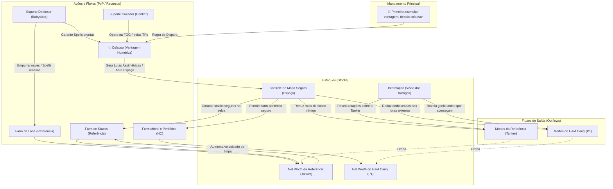

# 🧠 Modelo de Sistemas Táticos (Systems Thinking) — Ode

Este documento mapeia o funcionamento do jogo Dota 2 sob a ótica de **Sistemas Complexos**, dividindo as premissas da **Ode** em **Estoques**, **Fluxos**, **Loops de Feedback** e **Pontos de Alavanca**, com foco nas dinâmicas de combate (PvP).

---

## 📜 Os Mandamentos da Ode

Toda análise e execução estratégica do nosso time deve respeitar a lei inviolável do colapso:

> **"Primeiro acumular vantagem, depois colapsar."**
> — *Mandamento da Ode*

---

## 📊 Diagrama de Fluxos e Estoques (Foco em PvP)

Abaixo está a representação visual de como a **Referência (Tanker)**, os suportes e a segurança do **Hard Carry (P1)** se integram sob a ótica do novo mapa expandido:

---

## 📌 Estoques (Stocks) e Fluxos (Flows)

### 1. Estoque Principal de Combate: Net Worth da Referência (Tanker)
*   **O que é:** O acúmulo de itens de sobrevivência ativa (BKB, Shroud, Pipe) que permitirá ao Tanker iniciar e sustentar as teamfights.
*   **O Gargalo do Farm Lento:** Por ser um herói com menor mobilidade, o Tanker não consegue correr pelo mapa gigante atrás de creeps. Os **STACKS** são o seu fluxo de entrada seguro para garantir seus picos de itens.

### 2. Estoque de Segurança Econômica: Net Worth do Hard Carry (P1)
*   **O que é:** O ouro acumulado do P1 para limpar a luta a partir da segunda linha.
*   **O Fluxo de Farm Móvel:** O HC não fica estático em uma única rota. Ele utiliza um fluxo móvel e periférico (*FL_MobFarm*), farmando as rotas externas do mapa. Esse farm só é viável se o time mantiver um bom nível de *Controle de Mapa Seguro (MC)* e *Informação (VI)*.

---

## 🔄 Loops de Feedback (Causal Loops)

### Loop de Aceleração da Referência (R1)
*   `Mais Net Worth no Tanker` ➔ `Maior facilidade para limpar os Stacks locais` ➔ `Obtensão mais rápida de itens de utilidade/frontline` ➔ `Maior facilidade para absorver teamfights`.

### Loop de Colapso Assimétrico (R2) — "Vantagem ➔ Colapso"
*   `Cores com Spells ativas (Vantagem)` ➔ `Suporte Caçador ganka perto de estruturas` ➔ `TP defensivo dos Cores` ➔ `Colapso com Vantagem Numérica` ➔ `Abates / Torres derrubadas` ➔ `Mais Controle de Mapa Seguro (MC)`.
*   **Consequência**: O aumento do *Controle de Mapa Seguro* desbloqueia diretamente a segurança do *Farm Móvel e Periférico do HC*, permitindo que ele limpe as bordas do mapa sem ser interceptado pela FOG inimiga.

---

## 🎯 Ponto de Alavanca do Sistema: O Dilema da Rotação Inimiga

O colapso da Ode atua diretamente em um ponto de decisão do adversário:
*   Ao forçar vantagem numérica perto de nossas estruturas defensivas, forçamos o oponente a uma escolha de perda:
    1.  Tentar responder ao gank em menor número e morrer na luta de colapso.
    2.  Recuar e abandonar a disputa, permitindo que a Ode consolide o Controle de Mapa Seguro (*MC*).
