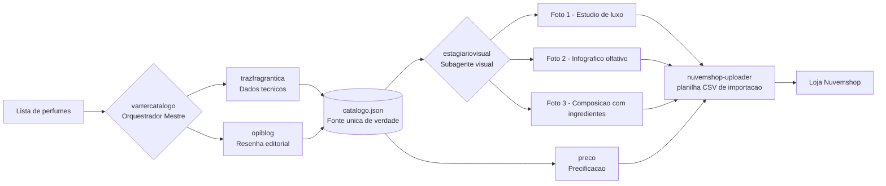

# 🏛️ Montalk — Parfum d'Artiste

**Sistema de automação de e-commerce orientado por um agente de IA**, desenvolvido para uma loja de decantes de perfumes de nicho na plataforma **Nuvemshop**.

O projeto transforma uma simples lista de "Marca – Nome" em um produto pronto para a loja: coleta os dados técnicos do perfume, enriquece com curadoria editorial, **gera automaticamente as três fotos de produto** (composições fotorrealistas de luxo), calcula a precificação e monta a planilha de importação — de ponta a ponta.


> ⚠️ **Projeto real, em desenvolvimento**, construído para um cliente. Este repositório documenta a arquitetura e as automações do pipeline. Credenciais, tokens e dados sensíveis não são versionados.

---

## ✨ O que ele resolve

Cadastrar um decante de perfume de nicho manualmente é lento e repetitivo: pesquisar a pirâmide olfativa, escrever a descrição, produzir fotos de padrão editorial, definir preço e formatar a planilha de importação. Este sistema executa esse fluxo **de forma autônoma e padronizada**, mantendo um nível de acabamento visual e textual "Classe A".

- 🔎 **Coleta de dados** do Fragrantica (nota, votos, pirâmide olfativa, acordes, perfumista);
- ✒️ **Curadoria editorial** a partir das resenhas do blog *ÇaFleureBon*, com supervisão anti-alucinação;
- 🖼️ **Geração automática das 3 fotos** de produto via IA generativa (Gemini) + composição gráfica;
- 💰 **Precificação** inteligente de decantes (lógica de arbitragem de mercado);
- 📦 **Exportação** para a planilha de importação em massa da Nuvemshop (variações 2/5/10 ml, SKUs, frete).

---

## 🧠 Arquitetura

O sistema é um **agente de IA** com governança explícita (definida em [`.agents/AGENTS.md`](.agents/AGENTS.md)) e uma **arquitetura modular baseada em _skills_** — cada capacidade é uma unidade isolada com sua própria documentação e scripts.

**Princípios de governança do agente:**
- 🧾 **Memória de sessão** — salva e retoma o estado do trabalho entre sessões (`session-resumo`), evitando retrabalho;
- 🔁 **Quality Gate com auto-correção** — todo fluxo crítico passa por um loop de crítica → refinamento (até 5 ciclos) antes de entregar;
- 🧪 **Validação unitária antes do lote** — valida o fluxo com 1 item antes de processar o catálogo inteiro, economizando cota de API e evitando erros em escala;
- 📚 **Fonte única de verdade** — `catalogo.json` centraliza todos os metadados do produto.



---

## 🧩 Skills e componentes

| Componente | Papel |
|---|---|
| **`varrercatalogo`** | Orquestrador mestre: executa o pipeline completo, chamando as ferramentas em sequência. |
| **`trazfragrantica`** | Coleta dados do Fragrantica (nota, votos, pirâmide, acordes, perfumista) e atualiza a base local. |
| **`opiblog`** | Curadoria editorial das resenhas do *ÇaFleureBon* (resumo crítico + ocasiões de uso) com pipeline de IA em 2 etapas e supervisão anti-alucinação. |
| **`estagiariovisual`** _(subagente)_ | "Maestro de arte": orquestra as Fotos 1, 2 e 3 e aciona a geração de imagem via Gemini quando a composição ainda não existe. |
| **`trazfragrantica3`** | Gera a **Foto 1** — frasco original em qualidade de campanha (estúdio de luxo) + validação de semelhança visual. |
| **`render_profiles`** | Gera a **Foto 2** — infográfico do perfil olfativo (acordes, notas, frasco). |
| **`trazfragrantica2`** | Gera a **Foto 3** — composição fotorrealista (frasco + ingredientes) em 1280×1380 px. |
| **`nuvemshop-uploader`** | Converte a listagem em CSV de importação da Nuvemshop (variações de volumetria, SKUs, pesos e dimensões de frete). |
| **`preco`** | Precificação de decantes por ponderação de mercado (arbitragem Brasil/China). |
| **`session-resumo`** | Persistência de estado entre sessões (memória operacional do agente). |
| **`limp`** | Limpeza seletiva do ambiente de trabalho após sessões de desenvolvimento. |

---

## 🛠️ Stack técnica

- **Python 3** — orquestração, scraping e processamento;
- **Google Gemini** — geração de imagens fotorrealistas dos produtos;
- **Playwright** — renderização de cards (HTML/CSS → imagem) em alta resolução;
- **urllib / scraping** — coleta de dados do Fragrantica;
- **HTML + CSS** — _templates_ de composição e infográficos;
- **JSON** — `catalogo.json` como base de dados do catálogo;
- **Nuvemshop** — plataforma de e-commerce (importação via CSV).

---

## 📁 Estrutura do repositório

```
.
├── .agents/                # Governança do agente (regras) e skill do subagente visual
│   ├── AGENTS.md
│   └── skills/estagiariovisual/
├── skills/                 # Capacidades modulares do agente (cada uma com SKILL.md + scripts)
│   ├── varrercatalogo/     # Orquestrador do pipeline
│   ├── trazfragrantica/    # Coleta de dados (Fragrantica)
│   ├── trazfragrantica2/   # Foto 3 — composição olfativa
│   ├── trazfragrantica3/   # Foto 1 — estúdio de luxo
│   ├── opiblog/            # Curadoria editorial (ÇaFleureBon)
│   ├── nuvemshop-uploader/ # Exportação para a planilha da loja
│   ├── preco/              # Precificação
│   ├── session-resumo/     # Memória de sessão
│   └── limp/               # Manutenção do ambiente
├── subagents/estagiariovisual/  # Subagente orquestrador das imagens
├── PROJETOS/Bruno/         # Dados do cliente: catálogo, identidade visual e protocolos
│   ├── produtos/           # catalogo.json, planilhas de importação
│   ├── Identidadevisual/   # Manual e diretrizes de identidade visual
│   └── protocolos/         # Padrão de SKUs
└── docs/                   # Planejamento e backlog
```

---

## 🗺️ Status

Em desenvolvimento ativo. O núcleo do pipeline (coleta → enriquecimento → geração de imagens → exportação) está implementado e em refinamento contínuo, com foco em robustez de escala e consistência estética entre as peças.

---

## 👤 Autor

**Marcus Vinícius dos Santos**
[LinkedIn](https://linkedin.com/in/marcusv-santos-tech/) · [GitHub](https://github.com/cusmv6)
